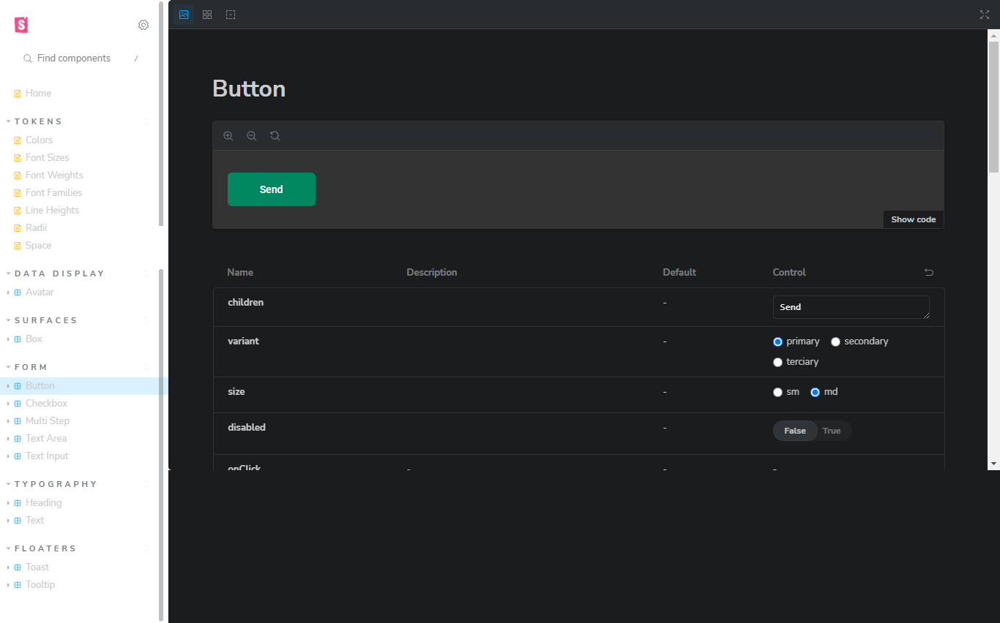

<div align="center">
  
</div>

<h1 align = "center">Storybook: Design System</h1>
<p>This project is a challenge of Ignite Course, by Rocketseat. The porpouse of this is to develop new components to "Ignite Call" interface and publish them to Storybook and NPM packages. A Design System is a set of standard components that can be used in a variety of User Interfaces that have repeated components, like Boxes, Buttons, Headings, Texts, Text Inputs, and others.</p>

<div align="center">
  <div style="display: flex; justify-content: space-between; align-items: center;">

    
    
    

  </div>
</div>

<h4 align="center"> 
	Storybook: Design System| Status: Done ✔️
</h4>

## Table of Contents

- [Features](#features)
- [Requirements to run the project](#requirements-to-run-the-project)
- [Running the application](#running-the-application)
- [Main Technologies](#main-technologies)
- [Final Result](#final-result)
  - [Home page](#home-page)
- [Deploy](#deploy)
- [License](#license)
- [Author](#author)
- [Contributing Guidelines](#contributing-guidelines)

## Features

On the Storybook page, you can browse the components created in ReactJS. Each component has its own properties, that can be modified.

## Requirements to run the project

<p>Before you run the project, check if you have [Node.js](https://nodejs.org/en/) installed on your machine, as well [Git](https://git-scm.com) to clone this repository.</p>

## Running the application

```bash
    # Clone this repository on your machine:
    $ git clone https://github.com/vitorlinsbinski/ignite-shop.git

    # Access the project folder in your terminal:
    $ cd design-system

    # Install all dependencies:
    $ npm install

    # Run the application:
    $ npm run dev
```

## Main Technologies

- [ReactJS](https://react.dev/)
- [TypeScript](https://www.typescriptlang.org/)
- [Storybook](https://storybook.js.org/)
- [Stitches](https://stitches.dev/)
- [Radix UI](https://www.radix-ui.com/)
- [Phosphor React](https://www.npmjs.com/package/phosphor-react)

## Final Result

### Storybook page



## Deploy

Check out the project working: https://vitorlinsbinski.github.io/design-system/

## Contributing Guidelines

Contributions are welcome! Whether you want to fix a bug, add a new feature, or improve documentation, your contributions are valuable.

### 1. Fork the Repository

Click the "Fork" button at the top right of this repository to create a copy in your GitHub account.

### 2. Clone the Repository

Clone your forked repository to your local machine using the following command:

```bash
git clone https://github.com/your-username/design-system.git
```

### 3. Create a Branch

Create a new branch for your contribution:

```bash
git checkout -b feature/your-feature-name
```

### 4. Make changes

Make your desired changes to the codebase. Ensure that your code is working well without problems or bugs.

### 5. Test your changes

Before submitting a pull request, test your changes thoroughly to ensure they work as expected.

### 6. Commit and Push

Commit your changes and push them to your forked repository:

```bash
git add .
git commit -m "Add your descriptive commit message here"
git push origin feature/your-feature-name
```

## License

This project is licensed under [MIT](https://choosealicense.com/licenses/mit/) License.

### Author

<a href="https://github.com/vitorlinsbinski">
 
 <br />
 <sub><b>Vitor Linsbinski</b></sub></a> <a href="https://github.com/vitorlinsbinski" title="">🚀</a>

Developed by Vitor Linsbinski

[](https://www.linkedin.com/in/vitorlinsbinski/)
